# emonGLCD Build Guide

Guide created and maintained by: [Ian Chilton](http://www.ichilton.co.uk/) - please direct any suggestions or corrections to: ian [at] ichilton [dot] co [dot] uk.

If you run into problems please post on the [forum](http://openenergymonitor.org/emon/forum).

The PCB is built in an orderly sequence starting with the resistors and small components that are low on the board and then working up to the bulkier parts like connectors. After soldering each component, you need to cut off the excess component leg from the bottom using some cutters.

It is very easy to cause shorts which will make the board or specific parts of it not work, take your time during the build, be precise, use minimal solder and carefully check each joint after soldering it. If you suspect any short, check it with a multimeter and fix any shorts there and then, before continuing.

If your new to soldering or looking to improve your technique we highly recommend these videos:

*   [EEVBlog Soldering Tutorial - Part 1: Tools](http://www.eevblog.com/2011/06/19/eevblog-180-soldering-tutorial-part-1-tools)
*   [EEVBlog Soldering Tutorial - Part 2: Soldering](http://www.eevblog.com/2011/07/02/eevblog-183-soldering-tutorial-part-2)
*   [EEVBlog Soldering Tutorial - Part 3: Surface Mount](http://www.eevblog.com/2011/07/18/eevblog-186-soldering-tutorial-part-3-surface-mount)

**It is strongly recommended you read through the whole of this guide and familiarise yourself with the steps before you start the actual build. In particular, note that in step 7 you may, depending on the PCB version, need to insert components in the opposite polarity to the silk screen legend.**

## Version 1.4 PCB:

*An error has crept in to the PCB layout affecting the JeePort. See [here](http://openenergymonitor.org/emon/node/2063) for details. If you are likely to use the JeePort, you should correct the fault before assembly begins*

## Introduction

Here's how to build up an emonGLCD as a step by step guide.

emonGLCD is a general purpose wireless graphical LCD display unit. Powered by an Atmega328 with an Arduino bootloader.

The emonGLCD is designed to drive a 128x64 GLCD display based on the ST7565 driver. The board has a built in HopeRF RFM12B wireless module to receive data from the emonTx energy monitoring node or an emonBase (Nanode-RF web-connected basestation) which in turn could pull aggregated data from a web-sever to be displayed.

The emonGLCD has an on-board temperate sensor, light sensor and two tri-color ambient indicator LED's.

## Step 1 - Identify Components and Kit Contents

Layout and identify the components from the kit.


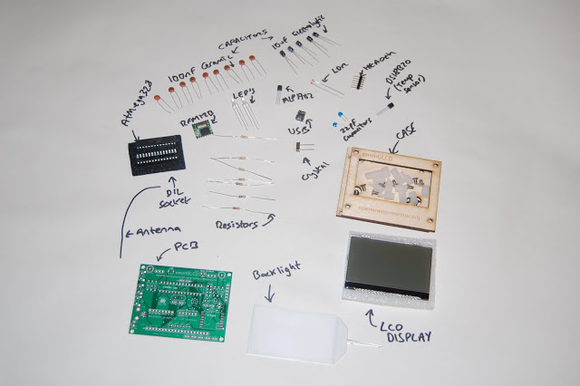

Here are all the components required to build your emonGLCD:

*   The emonGLCD PCB
*   5x 10k Resistors (Brown, Black, Orange, Gold)
*   3x 100R 0.24W Resistors (Brown, Black, Brown, Gold) - standard resistor size
*   1x 4.7k Resistor (Yellow, Violet, Red, Gold)

*   2x 22pF Ceramic Capacitors
*   9x 100nF (0.1uF) Ceramic Capacitors
*   5x 10µF Electrolytic Capacitors
*   1x Atmel ATMega328 - the main microcontroller
*   1x 28-Pin DIL Socket
*   1x RFM12B Radio Module - available in 433Mhz or 868Mhz versions
*   1x 165mm (433Mhz) or 82mm (868Mhz) Wire for RFM12B Antenna
*   1x 16MHz Crystal - for the ATMega328.
*   1x USB Mini B Socket
*   1x Microchip MCP1702 3.3v Voltage Regulator
*   1x Bi-Colour LED's
*   1x 6-way header
*   1x DS18B20 Digital Thermometer
*   1x Light Dependant Resistor
*   1x ST7565 128 x 64 LCD Display
*   1x White LED Backlight
*   Case + Spacers + Screws


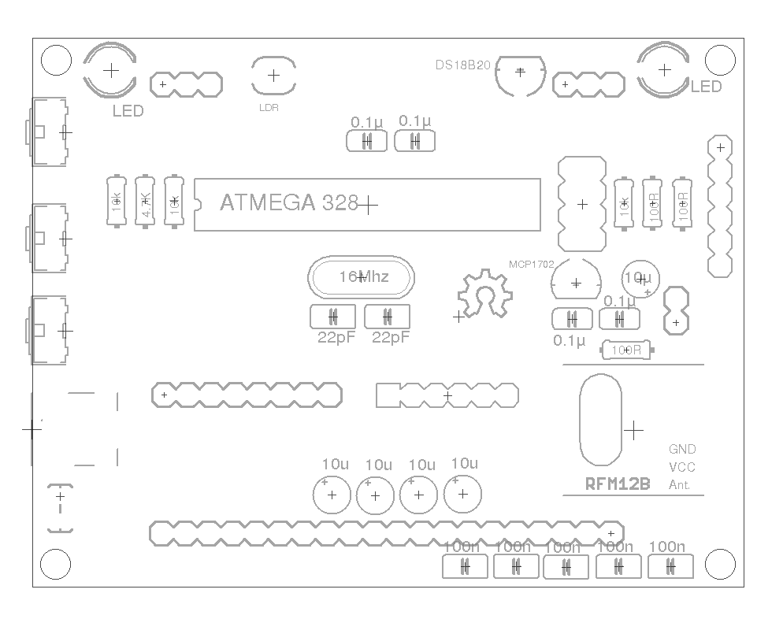


## Step 2 - 10k Resistors

Start with the resistors. Bend each leg of the resistor over 90 degrees, right next to the body. It's recommended that you align them all in the same direction.

First we add the 5x 10k resistors - their colour code is: Brown, Black, Orange, Gold.

For emonGLCD V1.4 / V1.5:

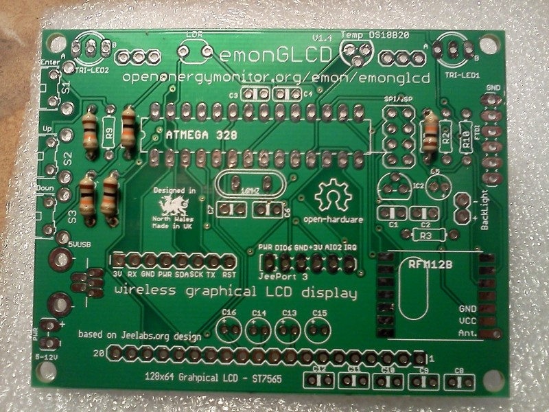


Note: all other photos in this build guide will refer to emonGLCD V1.3\. There are only a few minor changes between the two versions. See [this blog post](http://blog.openenergymonitor.org/2012/07/emonglcd-v14/) for details.

## Step 3 - 100R Resistors

Add the 3x 100R resistors - their colour code is: Brown, Black, Brown, Gold.

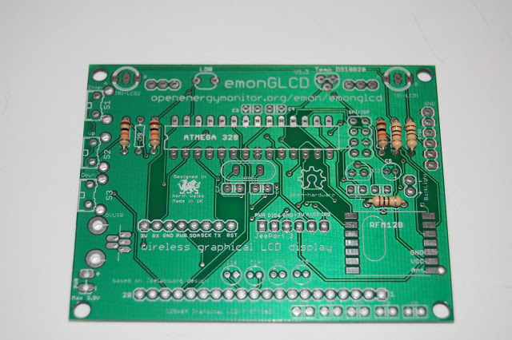

## Step 4 - 4.7k Resistor

Add the 4.7k resistor - it's colour code is: Yellow, Violet, Red, Gold.

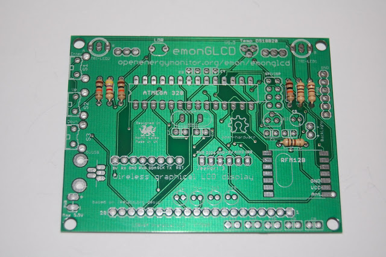

## Step 5 - 22pF Ceramic Capacitors

Add the 2x 22pF ceramic capacitors - they are either blue (as per the photo) or small brown discs labeled 22 and with black tips.

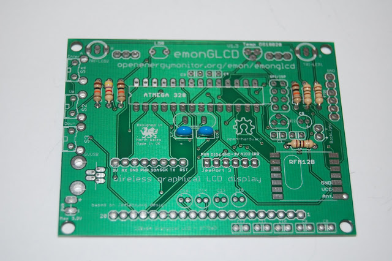

## Step 6 - 100nF Ceramic Capacitors

Add the 9x 100nF ceramic capacitors - they are labeled 104.


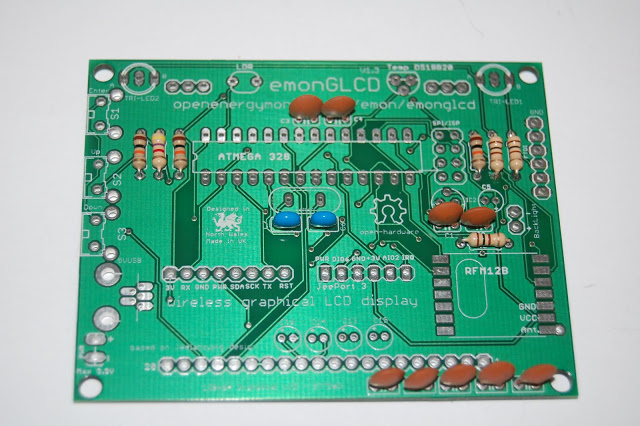


## Step 7 - 10µ F Electrolytic Capacitors

PCB rev V1.5 (current as of June 2013 onwards): Add the 5x 10µF electrolytic capacitors The PCB is marked with a + symbol to indicate positive lead. The capacitors are marked with a white strip and a short leg to indicate the negative lead and a longer leg to indicate the positive lead.

**_PCB rev V1.3 & V1.4 (kits bought before June 2013) Important: Due to an error on PCB V1.3 & V1.4 C13 and C14 must be inserted the opposite way round to the marked polarity (short leg to +). This has been fixed on V1.5, see above ^_**
_(If in any doubt, check the PCB version number on the top edge of the board above "emonGLCD")_

All other capacitors should be inserted the correct way as marked on the PCB.

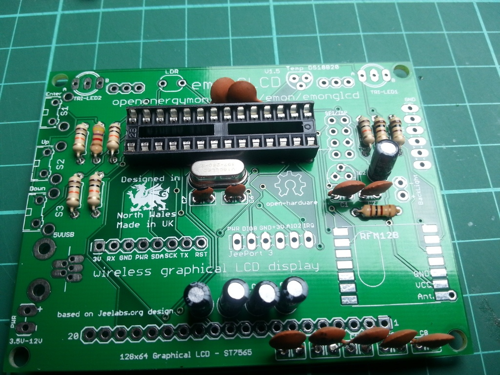

## Step 8 - 16MHz Crystal

Add the 16MHz crystal - it can go either way round.

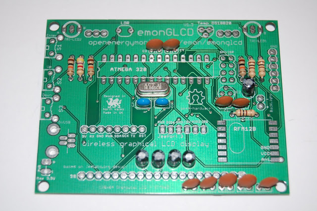

## Step 9 - LED's

Add the 2x LED's. They are Bi-Colour so have 3x legs. The PCB is marked A and B - the shortest leg should be towards 'B' and long leg towards 'A'. Remember that the rear of the case will cover these up so you might want to bend them through 90 degrees so they point upwards. I preferred to leave them so they shine into the back of the case so they are not so bright but still very visible when the case is on.


## Step 10 - MCP1702 3.3V Voltage Regulator

Add the MCP1702 3.3V Voltage Regulator - the flat edge goes towards the bottom of the board as per the markings. Note that it looks identical to the DS18B20 so you'll need to look carefully at the markings under some light to spot which is which.

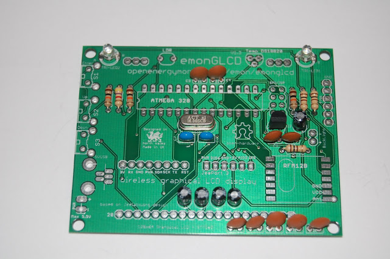


## Step 11 - DS18B20 Digital Thermometer

NOTE: When fitted in its intended position on the pcb, the digital thermometer might read up to 3 °C higher than the true ambient temperature, due to heat dissipated by the processor and other components. This effect can be largely eliminated by extending the component leads so that the sensor is at the bottom of the unit. The soldered joints at the sensor must be individually sleeved. You may wish to delay fitting the extended leads until the assembly is almost complete. See [here](http://blog.pcunha.org/2013/01/emonglcd-temperature-hack-correcao-para.html) for a pictorial guide to implementing this modification.

Add the DS18B20 Digital Thermometer - the flat edge goes towards the top of the board as per the markings.

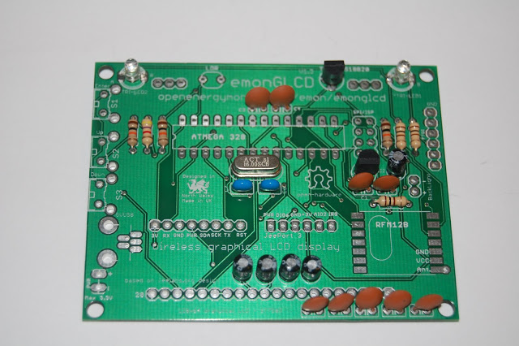


## Step 12 - Mini USB Socket

Add the mini USB socket.

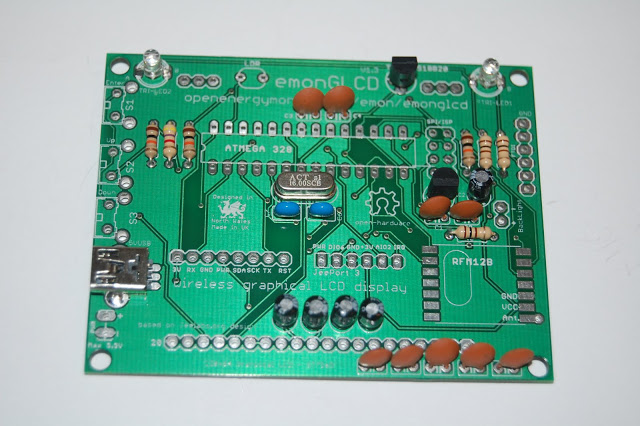


## Step 13 - Light Dependent Resistor (LDR)

Add the Light Dependent Resistor (LDR). Note that this will be covered up by the back of the case so you will want to bend it through 90 degrees and have it pointing upwards rather than flat like I have it in the photo.


## Step 14 - 28 Pin DIL Socket

Add the DIL socket. The notch on the socket should go to the left of the board, as per the markings on the PCB.

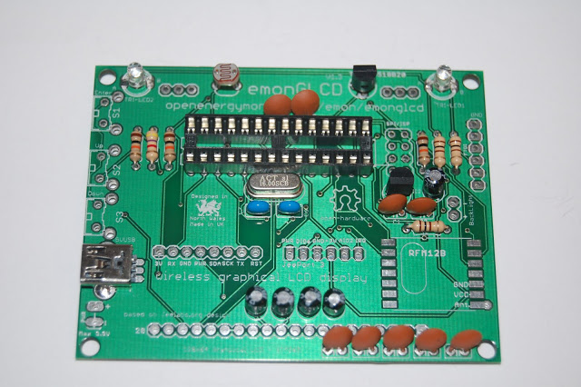


## Step 15 - Programming Header

Add the 6-pin programing header at the bottom of the board. This will be covered up by the back of the case, so if you want to be able to program the device without removing the back, you'll either need to bend out the pins, or you can put it on sticking outwards by laying the pins flat over the pads on the under side of the board and soldering them on top.

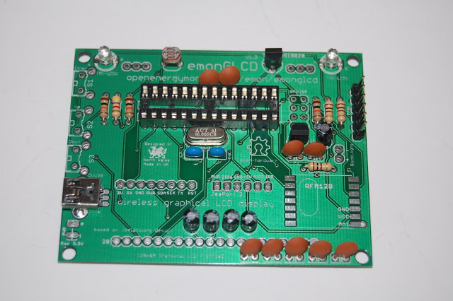


## Step 16 - Voltage Check (optional)

We now need to check the voltage is correct before we add any of the expensive components. Power the board with either an FTDI programming cable or a mini USB and measure the voltage between the GND and VCC pads on the RFM12B socket. You should get 3.3V. If you get more than this, you should work out what has gone wrong before you continue.

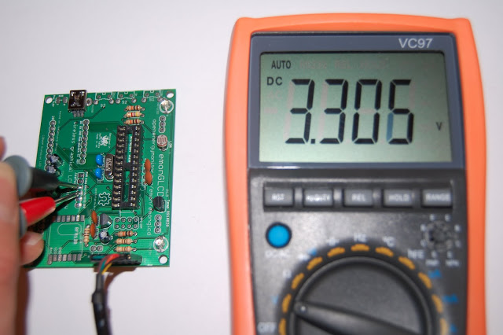


## Step 17 - RFM12B

Add the RFM12B module. You can see the shapes of the crystal on the PCB. Position the module in place over the pads and gently apply heat and solder the opposite corners to hold it in place so you can solder the remaining pads.

<u>NOTE</u> The RFM69CW module is different. Ignore the printed footprint and carefully check the orientation before soldering. All the very small surface-mount components should be in the bottom-right corner, the gold dot on the RFM69CW chip should be top-right.


## Step 18 - Antenna

Add the antenna by soldering the end to the bottom right pad on the RFM12B module.

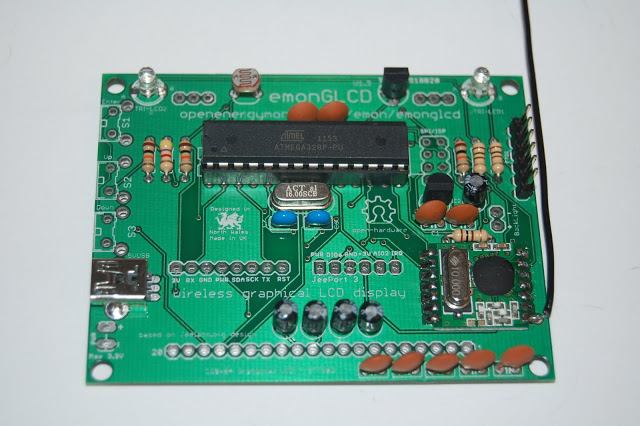


Step 19 - ATMega328

We can now add the ATMega328 chip. You will need to bend the pins in slightly by resting the chip sidewards on the desk and rolling it forwards to bend the pins in. Do the same with the other side.


## Step 19b - Solder in the switches

## Step 20 - Backlight

The next step is to add the backlight. Here is a video explaining this part:

https://www.youtube.com/watch?v=YMlDqEKnQYQ

After following that, it should look like this:


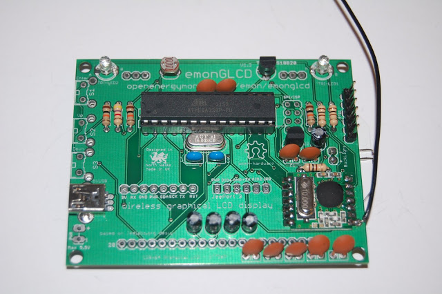


## Step 21 - Testing the LCD Display

You should now test the LCD display before soldering it as it is very hard to de-solder later if something is wrong. This video explains the process:

[https://www.youtube.com/watch?v=AN78HUO_Eg8](https://www.youtube.com/watch?v=AN78HUO_Eg8)


The ATMega will come with Arduino Optiboot 4.4 bootloader (select Uno in IDE) but with no sketch uploaded. The correct sketch must be uploaded using Arduino IDE. You should use [this sketch](https://github.com/openenergymonitor/EmonGLCD/tree/master/tester) to test with.

It's also a good idea to test the LED backlight to check you have the polarity the correct way (long leg to +) before soldering.

## Step 22 - LCD Display Position

We are now ready to fit the LCD Display.

First take the display, and place it through the holes on the PCB, but do not solder it yet.

Next, we need to fit the front of the case. Take the plastic spacers and use the screws to go through the front of the case into the spacers, then use the spacers with screw threads to go through the PCB into the spacers with the front, as shown here:

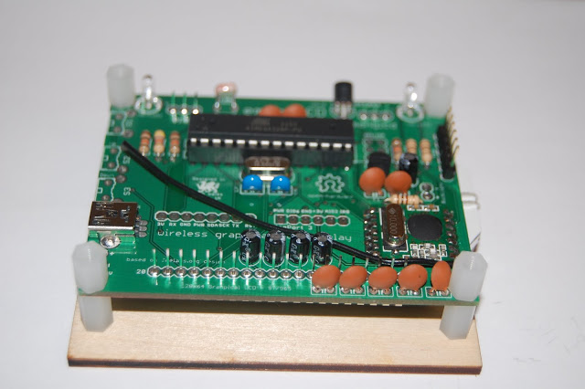


This video will help guide you through getting the display in position:

[https://www.youtube.com/watch?v=969oFOiuSsY]https://www.youtube.com/watch?v=969oFOiuSsY)

## Step 23 - LCD Display Solder

Once you have the display in the correct position (just resting very lightly on the backlight), we need to solder it in place. Solder a just a few pins at first, check it's level and aligned and then solder the remaining pins.

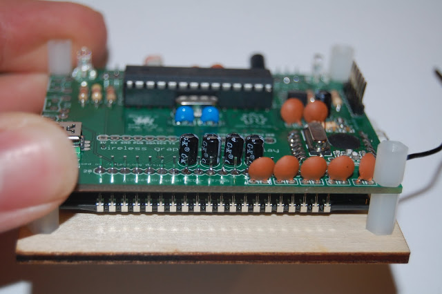


## Step 24 - Back of Case

Now fit the back of the case using the remaining screws.

### Note: now is a good time to fit the stand legs if needed as described in step 26

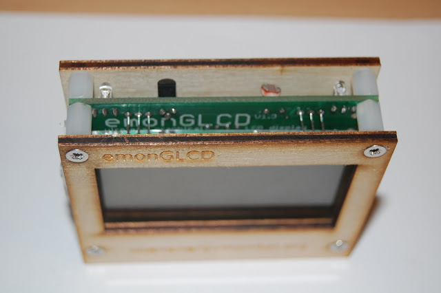

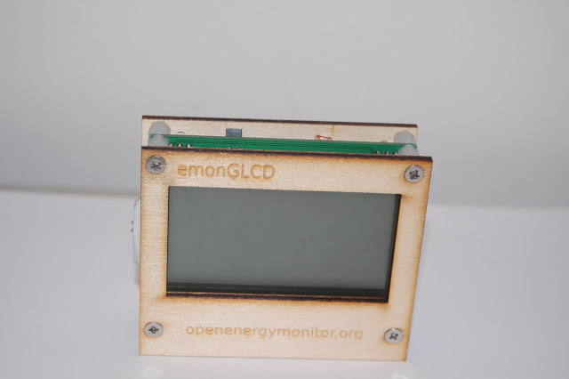

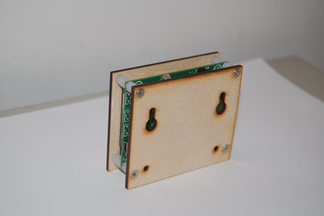

## Step 25 - Glue Backlight in Place

If you have a glue gun, place a small amount of glue between the backlight and the PCB to hold it in place.

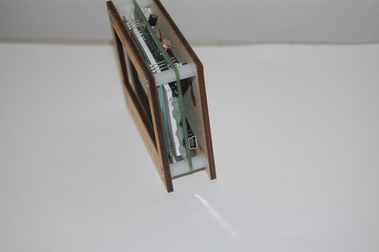

## Step 26 - Stand

We can now add the stand.

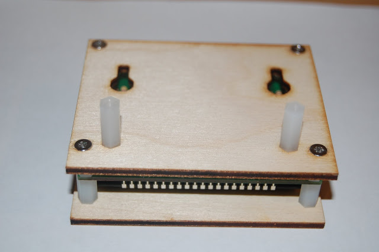

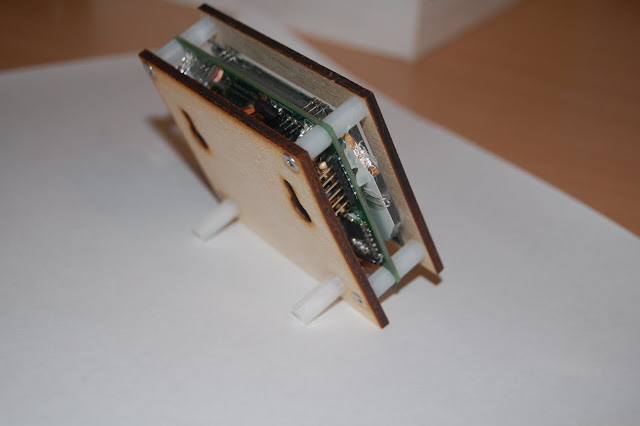


## Completed Unit

Here is the completed unit running the emonGLCD Tester sketch, see next step for how to upload firmware.

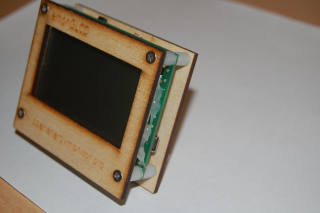

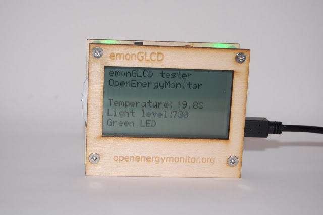

## Firmware Upload

The ATmega328 will come with Arduino Optiboot 4.4 bootloader (select Uno under tools>boards in Arduino IDE) but with no sketch uploaded. The correct sketch must be uploaded using Arduino IDE.

emonGLCD Arduino firmware can be downloaded from: [https://github.com/openenergymonitor/emonGLCD](https://github.com/openenergymonitor/emonGLCD) see github readme in the firmware folder for Arduino library instructions and firmware details.

*Note: Set #define RF69_COMPAT 1 at the top of the firmware examples if your using the RFM69 module*

For instructions on how to upload firmware using PlatformIO see []'Compiling' of the User Guide](https://guide.openenergymonitor.org/technical/compiling)

## emonBase Setup

By default the emonGLCD receives data from emonTx on node 10, it also has the ability to received the current time back from the internet sent from emonHub on the Raspberry Pi broadcast via the RFM12Pi. For this to happen a line must be added to the emonhub.conf file:

"sendtimeinterval = 60"

to set [emonHub](https://github.com/openenergymonitor//emonhub) to send the time to the emonGLCD every 60's, the line should be added to `emonhub.conf` file:

e.g

`[interfacers]`

# This interfacer manages the RFM2Pi module

```
[[RFM2Pi]]
Type = EmonHubJeeInterfacer
[[[init_settings]]]
com_port = /dev/ttyAMA0
[[[runtimesettings]]]
group = 210
frequency = 433
baseid = 15
sendtimeinterval = 60
```
