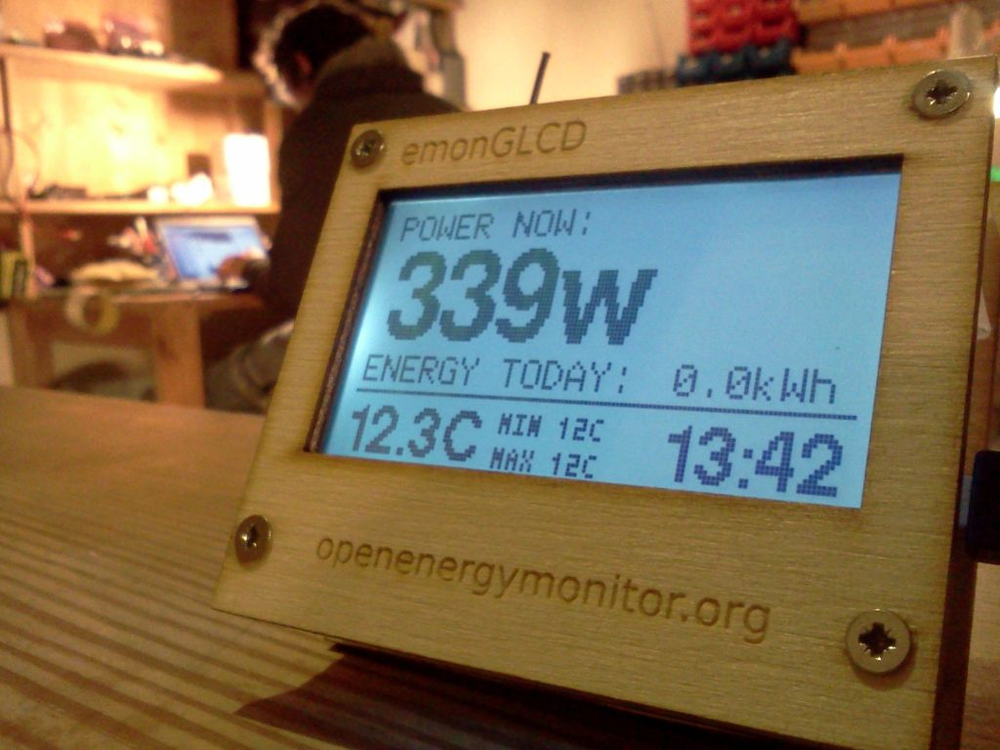

# open-source wireless graphical display - arduino code compatible

**Discontinued**

***

A general purpose wireless graphical LCD display unit. Powered by an Atmega328 with an Arduino bootloader.

The emonGLCD is designed to drive a 128x64 GLCD display based on the ST7565 driver. The board has a built in HopeRF RFM12B wireless module to receive data from the emonTx energy monitoring node or an emonBase (Nanode-RF web-connected basestation) which in turn could be pulled aggregated data from a web-sever to be displayed.

The emonGLCD has an on-board temperate sensor, light sensor and two tri-color ambient indicator LED's.

## Features

* ATmega328 with Arduino Uno bootloader
* 128x64 ST7565 LCD display
* White PWM LED backlight
* On-board HopeRF RFM12B wireless transceiver module
* Power supply: 5VDC via mini-USB conector
* DS18B20 on-board temperature sensor
* On-board LDR light-level sensor
* Based on JeeLabs.org design. Uses Adafruit/JeeLabs GLCD library
* Software RTC updated from the internet via emonbase.


## Build Guide

[Pictorial Build Guide](buildguide/readme.md)

***

# Required Arduino Libraries

* Builds on JeeLabs hardware and uses JeeLabs libraries:
* Download the JeeLabs Ports and RF12 library here (insert into Arduino librarys folder):
* https://github.com/jcw/jeelib	-RFM12 library
* https://github.com/jcw/rtclib   -used for time keeping to reset kWh at midnight
* https://github.com/jcw/glcdlib	-GLCD library

On-board DS18B20 digital temperature sensor uses:
Dallas Temperature library: http://download.milesburton.com/Arduino/MaximTemperature/ (version 372 works with Arduino 1.0)
OneWire library: http://www.pjrc.com/teensy/td_libs_OneWire.html

# emonGLCD sketch examples

*Note: Set #define RF69_COMPAT 1 at the top of the firmware examples if your using the RFM69 module*

* **HomeEnergyMonitor:** Home Energy Monitor Example (http://openenergymonitor.org/emon/applications/homeenergy) for dispaying data from single CT emonTx, and posting on-board temperature online to emoncms with emonBase/NanodeRF. Also gets time from interent via NanodeRF.



* **HomeEnergyMonitor_Old:** an old version that is not based on the templates implementation

* **SolarPV:** Solar PV monitoring example (http://openenergymonitor.org/emon/applications/solarpv) for displaying data from 2CT solar PV monitoring emonTx (type 1 and 2 - see comments in sketch). Posts room temperature online to emoncms via emonBase/NanodeRF. Also gets current time for interent via NanodeRF.


* **SolarPV_Old:** an old version that is not based on the templates implementation

* **Template_Example:** basic template implementation example

* **Tester:** simple sketch to test the function of the temperature sensor, light sensor and tri-colour LED's. Example can be used with or without the LCD and without the RFM12B. If LCD is connected results will be displayed on LCD.

* **GLCD_SSS** RF Signal Strength Meter and scanner for 464 or 868MHz bands by Martin Roberts: http://openenergymonitor.org/emon/node/2395

# Template use

```c
draw_power_page(char* powerstr, double powerval, char* energystr,  double energyval)

draw_temperature_time_footer(double temp, double mintemp, double maxtemp, double hour, double minute)

draw_solar_page(double use, double usekwh, double gen, double maxgen, double genkwh, double temp, double mintemp, double maxtemp, double hour, double minute, unsigned long last_emontx, unsigned long last_emonbase)

draw_dhw_page(double CYLT)

draw_history_page(double genkwh[7], double usekwh[7])
```

### Software NTP RTC

A Raspberry Pi-based emonhub can be configured to send the current time information to an emonGLCD.

On the Pi, edit the `emonhub.conf` (usually `~/data/emonhub.conf`). Find the section labeled `[[RFM2Pi]] [[[runtimesettings]]]`, add the following line. Save the file. No need to restart.

`interval = 300`

### Extend it

#### Create display graphics

RF Signal Strength Meter Scanner by Martin Roberts: See forum thread https://openenergymonitor.org/emon/node/2395
Touchscreen: https://github.com/nathanchantrell/EmonGLCD/blob/master/emonGLCD_ST7565_RGB_Touch/emonGLCD_ST7565_RGB_Touch.pde


See this forum thread for python tool to create GLCD graphics from a bitmap: https://openenergymonitor.org/emon/node/3957

## License

The emonGLCD is open hardware with the designs released under the Creative Commons Attribution-ShareAlike 3.0 Unported License. The schematics and board files can be viewed and downloaded from the openenergymonitor github hardware repository here:
